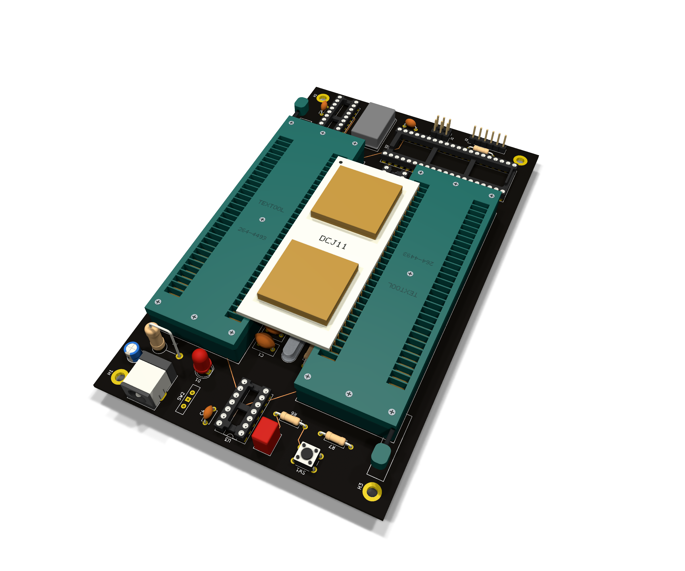

# DCJ11 test rig

**A small KiCad project designed from scratch with AI assistance.**
The idea is to design without manual CAD work. The human gives instructions,
AI does the work, and the human checks the result. This covers the circuit,
custom parts, 3D models and documentation. For PCB routing, the human used
an autorouter.

[AGENTS.md](AGENTS.md) holds the rules we use to work this way.
You can copy it and adapt it for your own projects.

The rig gives a DEC DCJ11 processor a serial console for a quick check.
It uses a 4 MHz crystal, a DC319A DLART and two ZIF sockets.
The [GAL source and programming file](logic/gal/README.md) are included.
The board and GAL logic have not been tested on real hardware.

[Open in KiCad 10](kicad/rig/rig.kicad_pro) ·
[Build guide](docs/build.md) ·
[Sources and credits](THIRD_PARTY.md)

Inspired by Peter Schranz's
[Modular DCJ11 SBC](https://www.5volts.ch/pages/dcj11sbc/).
